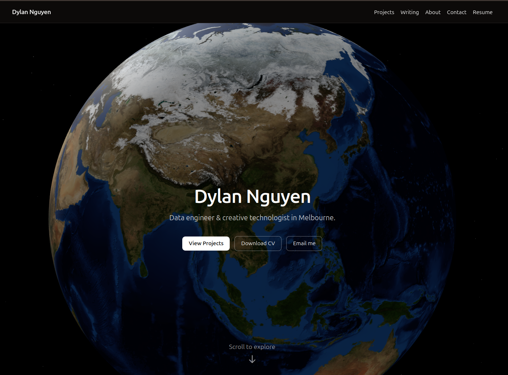

Personal website for Dylan built with Next.js App Router, TypeScript, and Tailwind CSS.


## Stack
- Next.js 15.5.2 (App Router)
- React 19
- Tailwind CSS v4 (+ @tailwindcss/typography)
- MDX for content
- next-seo for SEO
- @vercel/analytics for basic analytics

## Scripts
```bash
npm run dev       # Start dev server
npm run build     # Build for production
npm run start     # Start production server
npm run lint      # Next.js lint
npm run format    # Prettier write
```

## Content
- Posts: `content/posts/*.mdx`
- Projects: `content/projects/*.mdx`

Each MDX file supports frontmatter:
```md
---
title: Post Title
summary: Optional summary
date: 2025-01-01T00:00:00.000Z   # posts only
tags: [nextjs, mdx]
year: 2024                        # projects only
repo: https://github.com/...      # optional
demo: https://example.com         # optional
---
```

## Add a post/project
1. Create a new `.mdx` file under `content/posts` or `content/projects` with frontmatter as above.
2. The list pages will auto-discover and render it. Detail pages are generated for each slug.

## SEO/Brand
- Defaults live in `src/lib/seo.ts` (title template, description, OG/Twitter).
- Update `NEXT_PUBLIC_SITE_URL` in your environment for correct sitemap/robots.
- Replace `public/og.png` with a real OG image (1200×630).

## Resume
- Put `resume.pdf` in `public/` and the Resume page will link to `/resume.pdf`.

## Deploy to Vercel
1. Push the repo to GitHub.
2. Import into Vercel.
3. Set `NEXT_PUBLIC_SITE_URL` (e.g. `https://your-domain.com`).
4. Deploy. Vercel Analytics will start collecting basic metrics.

## Notes
- Accessibility: semantic HTML, keyboard-friendly nav, alt text on images.
- Performance: minimal JS, server-rendered MDX, optimized typography.